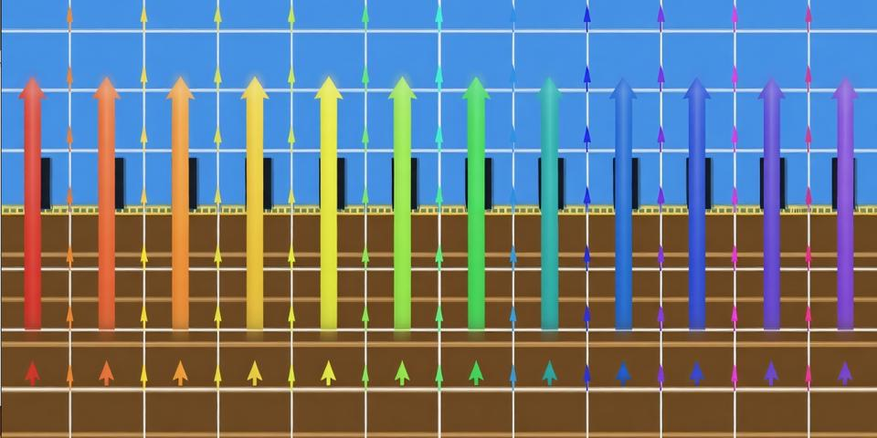
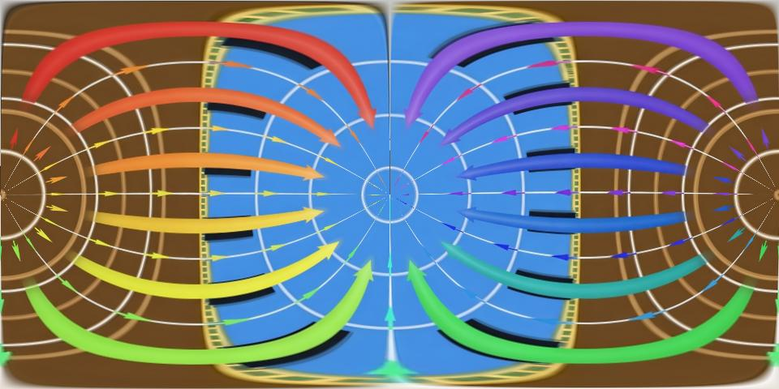
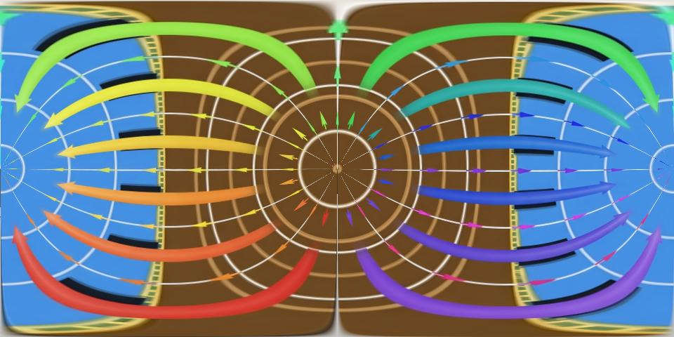
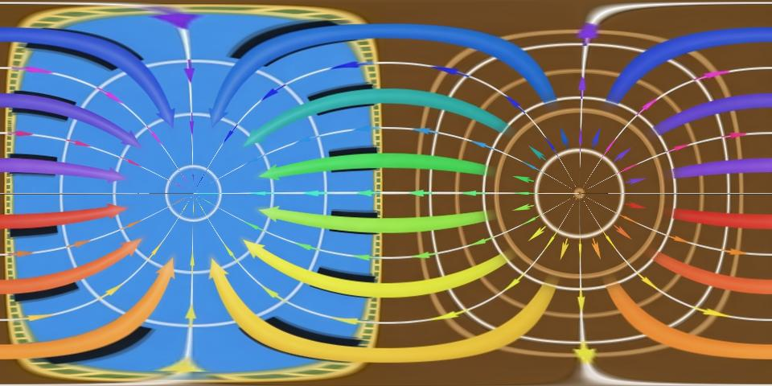
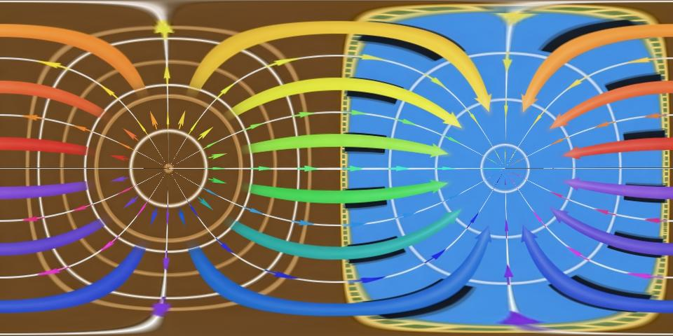

# 全景图旋转变化对比报告

## 概述

本报告直观展示 equirectangular（等距柱状投影）全景图在 Pitch 和 Roll 旋转下的视觉变化。全景图默认拍摄姿态为相机竖直朝前，图像呈 2:1 比例（960×480），上半部分对应天空，下半部分对应地面，水平方向为 360° 环绕视野。

**坐标系约定：**

| 轴 | 旋转名称 | 物理含义 |
|---|---|---|
| X 轴 | Pitch | 上下仰俯（点头） |
| Z 轴 | Roll | 左右倾斜（歪头） |

---

## 原图（Resize 960×480）

相机竖直拍摄，上天下地的标准全景图。

- 图像顶部中心 → 天顶正上方
- 图像底部中心 → 天底正下方
- 图像水平方向 → 360° 环绕视野

---

## Pitch 旋转对比（绕X轴，上下仰俯）

### Pitch +90°（相机朝天看）

**变化描述：** 相机从水平前视转为垂直朝上。原本在图像顶部的天顶内容被"拉"到图像中央水平带上，整张图变成"前天后地"——中央展示天空，上下边缘对应原来的前方和后方。

### Pitch -90°（相机朝地看）

**变化描述：** 相机从水平前视转为垂直朝下。原本在图像底部的地面内容被"拉"到图像中央水平带上，整张图变成"前地后天"。与 pitch +90° 恰好上下互补。

### 小结

| 角度 | 图像中央水平带内容 | 图像上下边缘内容 |
|------|-------------------|-----------------|
| 0°（原图） | 前方地平线场景 | 上=天顶，下=天底 |
| +90° | 天顶（天空） | 原来的前方/后方 |
| -90° | 天底（地面） | 原来的前方/后方 |

---

## Roll 旋转对比（绕Z轴，左右倾斜）

### Roll +90°（相机顺时针倾斜90°）

**变化描述：** 相机绕视线方向顺时针旋转90°。全景图出现明显的非线性扭曲，天顶和天底内容发生90°的旋转偏移。这种"螺旋"形变是 equirectangular 投影下球面重映射的固有特征。

### Roll -90°（相机逆时针倾斜90°）

**变化描述：** 与 roll +90° 方向相反，扭曲方向镜像对称，天顶/天底内容沿相反方向偏移。

### 小结

| 角度 | 视觉效果 |
|------|---------|
| 0°（原图） | 正常水平视角 |
| +90° | 整体顺时针扭曲，天地内容侧移 |
| -90° | 整体逆时针扭曲，天地内容侧移 |

> **注意：** Roll 旋转在 equirectangular 投影中不是简单的图像旋转，而是复杂的非线性形变。

---

## 总结

| 旋转类型 | 全景图中的表现 | 是否产生形变 |
|---------|--------------|-------------|
| Pitch ±90° | 天地翻转，天顶/天底内容移到图像中央 | 是（非线性重映射） |
| Roll ±90° | 图像整体螺旋扭曲 | 是（非线性重映射） |

当全景相机存在姿态偏差时，pitch 和 roll 方向的偏差会导致图像产生非线性形变，给 VPR 特征匹配带来挑战。
