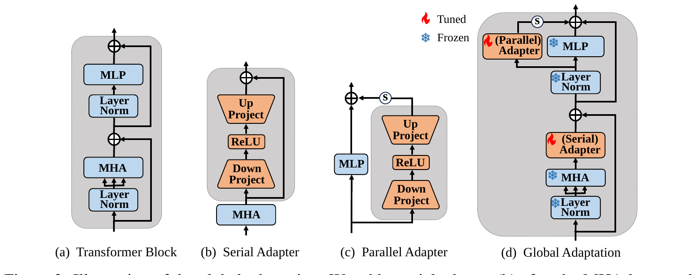
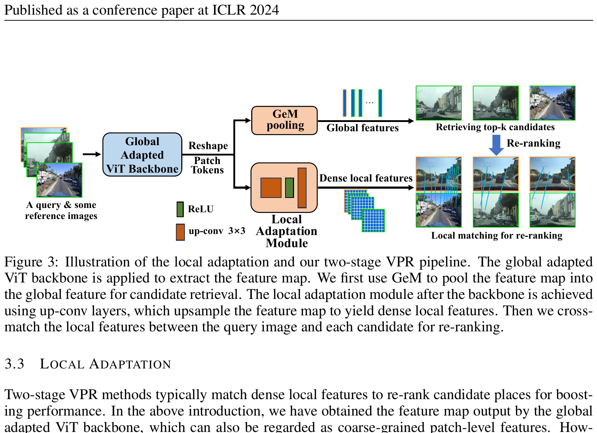
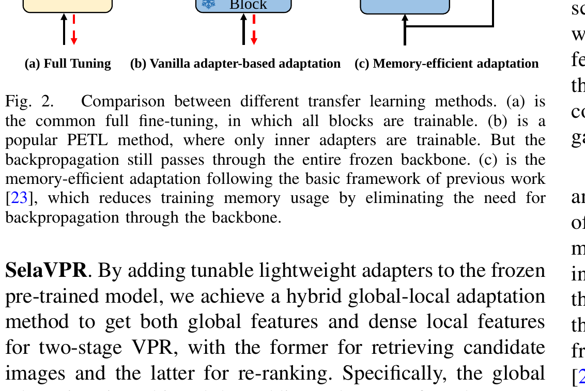
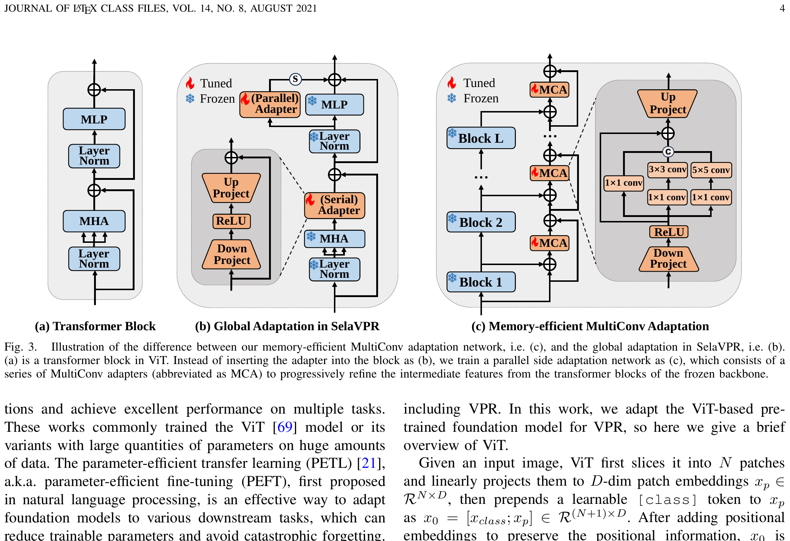
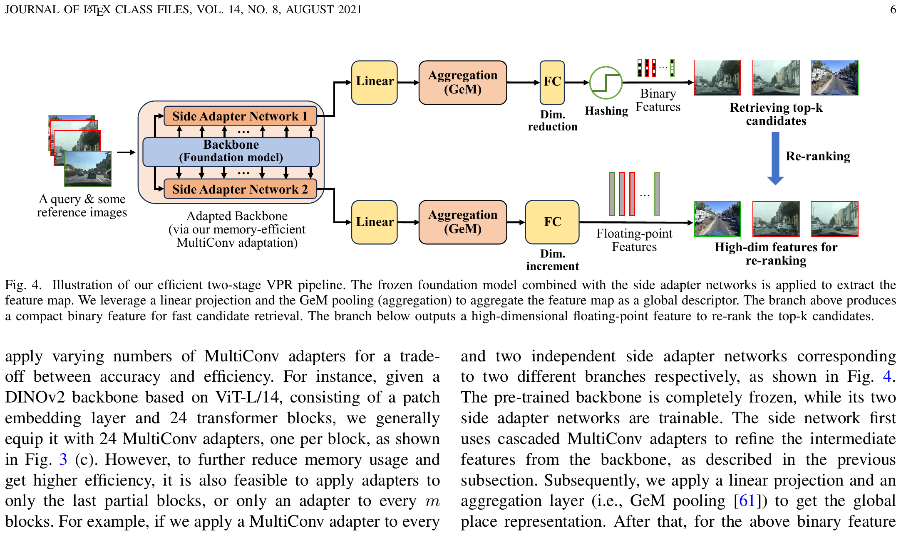

# 视觉位置识别技术演进：从 Bag-of-Words 到预训练视觉基础模型

## 背景：什么是视觉位置识别？

视觉位置识别（Visual Place Recognition, VPR）是计算机视觉与机器人学中的核心问题：**仅利用相机图像，判断当前观测是否对应某个曾经到访过的地点**。

想象一台机器人在楼宇中穿行、一辆汽车行驶在城市街道、一架无人机飞越校园——数小时甚至数月后，它再次到达一个似曾相识的位置，系统需要回答一个看似简单却至关重要的问题：“我来过这里吗？” 与 GPS 不同，VPR 不依赖卫星信号或外部地图，而是依靠视觉线索工作，因此可在室内、隧道、城市峡谷等 GNSS 失效环境中运行。

VPR 必须同时应对两类变化：

- **外观变化**：昼夜、季节、天气、阴影等导致同一地点“看起来完全不同”。
- **视角变化**：拍摄高度、朝向、距离不同，导致可见结构与纹理分布改变。

从系统角度看，VPR 在工程上就是一个面向**地点匹配**的图像检索问题，与**定位（localization）**、**闭环检测（loop closure）**紧密耦合：先在大规模图像库中快速召回候选，再对 Top-K 结果精排或验证，最终输出匹配地点或用于修正位姿。

### 典型应用场景

VPR 是自主系统长期可靠运行的“视觉记忆”，常见应用包括（参见 [OpenCV: Visual Place Recognition](https://opencv.org/visual-place-recognition/)）：

| 场景 | 作用 |
|------|------|
| 自主导航 | 在 GPS 不可靠时，识别曾到访的道路、室内空间或厂区通道 |
| SLAM / 机器人闭环 | 检测重访地点，触发闭环约束，修正里程计累积漂移 |
| 无人机测绘与巡检 | 跨多次飞行识别同一区域，支持一致建图与设施监测 |
| 增强现实（AR） | 跨会话将虚拟内容稳定锚定到真实世界位置 |
| 图像地点检索 | 根据用户照片，在大型街景/地图图像库中反查拍摄位置 |

在实际系统中，传感器漂移与环境变化会随时间累积误差；VPR 提供一种“回到熟悉地点”的机制，使系统能够识别旧场景并校正状态，从而支撑**长期、鲁棒的自主运行**。

---

本文按技术演进主线，梳理 VPR 从 BoW 词袋模型到预训练视觉基础模型的发展路径。从方法层面看，VPR 本质上就是一个**图像检索**问题：将查询图像编码为向量，在地理标记图像库中计算相似度并排序返回 Top-K 候选。本文所介绍的 BoW、VLAD、NetVLAD、GeM 直至 DINOv2 适配，均沿这一检索框架不断演进；各阶段的差异主要体现在**特征如何提取与聚合**，以及如何应对 VPR 特有的外观变化、视角变化与感知混淆。

本文按如下主线展开：

1. 基于局部特征的 BoW、DBoW、FBOW 体系。
2. VLAD、Fisher Vector、DenseVLAD 等聚合编码。
3. 深度学习全局描述子：CNN、NetVLAD、GeM、DELG、CosPlace、MixVPR 等。
4. 预训练视觉基础模型时代：DINOv2、AnyLoc、SALAD、SelaVPR、SelaVPR++、SuperPlace 等。
5. 工程流水线、评估指标、数据集与方法选型。

---

## 1. 问题定义与通用流水线

### 1.1 VPR 的任务定义

给定一张**查询图像** `q` 和一个**数据库** `D = {d₁, d₂, …, dₙ}`（通常由带地理标签的历史图像构成），VPR 系统的目标是：从 `D` 中找出与 `q` 来自**同一地点**的图像，并按匹配置信度排序。

形式化地，这一过程可以写成两步：

**第一步：为每张库图计算相似度**

```text
sᵢ = sim( f(q), f(dᵢ) ),   i = 1, 2, …, n
```

**第二步：按相似度从高到低排序，得到检索结果**

```text
rank(q, D) = [ d_{i₁}, d_{i₂}, …, d_{iₙ} ]

满足：s_{i₁} ≥ s_{i₂} ≥ … ≥ s_{iₙ}
```

其中：

- `f(·)` 是将图像映射为向量的**特征提取函数**（全局描述子、哈希码等）；
- `sim(·, ·)` 是**相似度函数**，例如余弦相似度、内积、负欧氏距离或负汉明距离；
- 实际系统通常只返回 Top-K（如 K=1, 5, 10）作为最终候选；大规模库上的排序与召回通常由 FAISS、HNSW 等近似最近邻索引加速。

在 VPR 中，"相似"的 ground truth 由**地理距离**（如 GPS 25 m 内）定义，而非主观语义上的"看起来像"。这带来几个典型难点：

- **视角变化**：同一地点可能从不同方向、不同高度拍摄。
- **光照与天气变化**：白天/夜晚、晴天/雨雪、阴影变化。
- **季节变化**：植被、雪、落叶会明显改变外观。
- **动态物体**：行人、车辆、临时遮挡。
- **感知混淆**：走廊、道路、建筑立面等重复纹理导致不同地点外观相似。
- **尺度与计算约束**：数据库可从几千张到上亿张，实时机器人还要求低延迟。

### 1.2 标准检索流水线

一个经典 VPR 系统常被拆成四层：

1. **特征提取**
   - 全局描述子：一张图一个向量，用于快速粗检索。
   - 局部特征：一张图多个关键点和描述子，用于精确匹配。

2. **索引与召回**
   - 倒排索引、KD-tree、HNSW、IVF-PQ、FAISS 等。
   - 目标是快速找出 Top-K 候选。

3. **重排序与验证**
   - 局部特征匹配、RANSAC、基础矩阵/单应性/本质矩阵验证。
   - 在机器人或 SLAM 中，还可能接 PnP 或位姿图优化。

4. **决策与定位**
   - 判断是否闭环、是否重定位成功。
   - 输出相似地点、图像 ID、相机位姿或地图节点。

粗检索追求大规模、高召回；重排序追求精度和可解释的几何一致性。很多方法的差异，本质上是在“表示能力、计算成本、鲁棒性、可扩展性”之间做取舍。

---

## 2. Bag-of-Words（BoW）与局部特征

### 2.1 从 SIFT/SURF/ORB 到局部特征集合

局部特征方法把图像表示为一组关键点和局部描述子：

```text
I -> {(x_j, y_j, scale_j, orientation_j, descriptor_j)}
```

代表性手工局部特征包括：

- **SIFT**：尺度空间 DoG 检测关键点，计算梯度方向直方图描述子。对尺度和旋转较鲁棒，精度高但计算较重。
- **SURF**：使用积分图和 Haar 小波响应加速，速度优于 SIFT。
- **ORB**：FAST 角点 + BRIEF 二进制描述子，并加入方向估计。速度快，适合实时 SLAM。
- **BRISK/FREAK**：二进制描述子，强调高效匹配。

局部特征的优势：

- 能处理部分遮挡和局部视角变化。
- 可以做几何验证，减少误匹配。
- 适合 SLAM 闭环检测和重定位。

局部特征的挑战：

- 一张图有大量描述子，直接两两匹配成本高。
- 数据库规模变大后，需要压缩、量化和索引。
- 弱纹理、重复纹理、夜晚或季节变化会导致关键点不稳定。

### 2.2 BoW：Bag of Visual Words

**BoW（Bag of Visual Words，视觉词袋）** 借鉴文本检索中的词袋模型，把局部描述子量化成“视觉词”，再用词频向量表示整张图。

#### 2.2.1 视觉词典构建

给定大量训练图像的局部描述子 `{x_n}`，使用聚类得到 `K` 个视觉词中心：

```text
C = {c_1, c_2, ..., c_K}
```

常见做法：

- SIFT 等浮点描述子：使用 k-means。
- ORB 等二进制描述子：使用层次 k-means、k-medians 或汉明距离聚类。

#### 2.2.2 描述子量化

每个局部描述子被分配到最近的视觉词：

```text
w(x) = argmin_k distance(x, c_k)
```

然后统计一张图中各视觉词出现次数，形成直方图：

```text
h_i[k] = count(w(x_j) = k)
```

#### 2.2.3 TF-IDF 加权

直接词频会让常见纹理词（如窗户、路面、树叶）权重过高。BoW 常用 TF-IDF：

```text
tf_{i,k} = n_{i,k} / sum_l n_{i,l}
idf_k = log(N / N_k)
v_{i,k} = tf_{i,k} * idf_k
```

其中：

- `N` 是数据库图像总数。
- `N_k` 是包含视觉词 `k` 的图像数。
- 稀有但有区分度的视觉词权重更高。

#### 2.2.4 倒排索引

BoW 可以高效检索的关键是倒排索引：

```text
word_id -> [(image_id, weight), ...]
```

查询图像只访问与其共享视觉词的数据库图像，从而避免扫描全部图片。文本检索中的余弦相似度、L1/L2 距离、归一化直方图相似度都可以用于排序。

#### 2.2.5 几何验证

BoW 的词频向量忽略了空间关系，所以 Top-K 候选通常需要局部匹配与 RANSAC：

1. 对共享视觉词中的局部描述子建立候选匹配。
2. 用最近邻比值测试、交叉验证筛除明显错误。
3. 用 RANSAC 估计单应性、基础矩阵或本质矩阵。
4. 根据内点数和重投影误差重排序。

#### 2.2.6 BoW 的优缺点

优点：

- 可扩展到大规模数据库。
- 倒排索引成熟，检索速度快。
- 与几何验证结合后精度较高。
- 对部分遮挡、裁剪有一定鲁棒性。

缺点：

- 视觉词量化有信息损失。
- 词典训练依赖数据分布。
- 忽略局部特征之间的高阶关系。
- 对强外观变化和弱纹理场景仍然困难。

BoW 是传统图像检索和 SLAM 闭环检测的基础范式，后续 DBoW、FBOW、VLAD、Fisher Vector 都可视为对“局部特征如何聚合和检索”的不同回答。

---

## 3. DBoW：面向实时 SLAM 的词袋实现

用户提到的 **DBOW** 通常指 **DBoW2/DBoW3** 这一类视觉词袋库。它们不是一个全新的理论模型，而是把 BoW 体系工程化，用于 ORB-SLAM 等实时视觉 SLAM 系统的闭环检测和重定位。

### 3.1 层次词典树

DBoW 常用层次聚类构建词典树：

```text
root
 ├── node
 │    ├── word
 │    └── word
 └── node
      ├── word
      └── word
```

假设分支因子为 `k`，深度为 `L`，叶子节点数量大约为 `k^L`。描述子从根节点开始逐层选择最近的子节点，最终落到叶子视觉词。

这种结构的作用：

- 将暴力查找最近词中心的成本从 `O(K)` 降低到约 `O(kL)`。
- 适合实时系统中大量 ORB 描述子的快速量化。
- 可同时保存中间节点信息，用于直接索引和特征匹配。

### 3.2 Inverted file 与 direct file

DBoW 系统中常见两类索引：

1. **Inverted file（倒排文件）**
   - 从视觉词到图像/关键帧列表。
   - 用于快速找到共享词的候选关键帧。

2. **Direct file（直接文件）**
   - 从图像到其特征在词典树中的节点分布。
   - 用于在候选图像之间快速找出可能对应的局部特征。

在 SLAM 闭环检测中，这种结构非常重要：先用 BoW 分数找候选关键帧，再快速建立 ORB 匹配，最后通过 Sim3、PnP 或位姿图优化验证闭环。

### 3.3 DBoW2/DBoW3 的特点

**DBoW2**：

- 在 ORB-SLAM 系列中被广泛使用。
- 支持二进制描述子和浮点描述子。
- 常与 ORB 特征、TF-IDF、L1/L2 归一化配合。

**DBoW3**：

- 更通用的 C++ 实现。
- 与 OpenCV 更紧密，便于支持不同描述子类型。
- 在接口和存储格式上更现代。

### 3.4 在 VPR/SLAM 中的工作方式

典型闭环检测流程：

1. 当前关键帧提取 ORB 特征。
2. 使用预训练 ORB 词典树量化为 BoW 向量。
3. 在关键帧数据库中查找高相似度候选。
4. 排除时序上过近的关键帧。
5. 对候选关键帧做 ORB 匹配与几何验证。
6. 如果内点足够多，则触发闭环或重定位。

### 3.5 DBoW 的价值与局限

价值：

- 工程成熟、速度快、内存可控。
- 非常适合实时 SLAM 中的闭环检测。
- 与 ORB 等轻量特征配合良好。

局限：

- 仍依赖手工特征和视觉词量化。
- 对强视角、光照、季节变化不如深度特征。
- 词典通常需要预训练，跨域时性能可能下降。

一句话概括：DBoW 是 BoW 在实时机器人系统中的高效工程化版本。

---

## 4. FBOW：更快的词袋工程实现

**FBOW（Fast Bag of Words）** 也是面向 SLAM/VPR 的词袋库，目标是比 DBoW2/DBoW3 更快、更易与现代 C++/OpenCV 工程集成。

### 4.1 核心思想

FBOW 仍然遵循 BoW 的基本逻辑：

```text
局部描述子 -> 词典树量化 -> BoW 向量 -> 倒排检索 -> 候选重排序
```

它的主要贡献在工程层面：

- 针对 ORB 等二进制描述子优化汉明距离计算。
- 采用更紧凑的数据结构和序列化格式。
- 支持 SIMD 指令优化，减少量化和评分开销。
- 与 OpenCV 描述子格式兼容，便于在 SLAM 系统中替换。

### 4.2 与 DBoW 的关系

FBOW 与 DBoW 的关系类似于“同一理论体系的不同实现”：

- 理论核心都是视觉词袋。
- 都依赖视觉词典、TF-IDF、倒排索引。
- FBOW 更强调速度、内存布局和现代 C++ 工程效率。
- DBoW2/DBoW3 的生态和历史使用更广，尤其在 ORB-SLAM 相关系统中。

### 4.3 适用场景

适合：

- 嵌入式或实时 SLAM。
- ORB 特征已经存在的系统。
- 数据库规模中等、延迟要求高的闭环检测。

不适合单独解决：

- 夜晚到白天、季节跨度大的长期重定位。
- 极端视角变化下的宽基线匹配。
- 需要语义级鲁棒性的城市级检索。

FBOW 的意义在于把传统 BoW 的速度推到更接近实时系统需求，但它没有改变 BoW 的表达能力上限。

---

## 5. FAB-MAP：概率图模型式地点识别

在 BoW 体系中，**FAB-MAP** 是非常经典的概率方法。它试图回答：给定当前图像中出现的一组视觉词，当前地点是否是地图中某个已知地点，还是一个新地点？

### 5.1 基本思想

FAB-MAP 使用视觉词出现/未出现作为观测，构建地点的概率模型：

```text
P(location | observed visual words)
```

它特别关注两个问题：

1. 视觉词之间并非独立，例如“窗户”和“墙面”经常共同出现。
2. VPR 需要判断新地点，而不仅是从数据库中强制选一个最近邻。

### 5.2 Chow-Liu 树

传统朴素贝叶斯假设词之间独立，但视觉词共现关系明显。FAB-MAP 使用 Chow-Liu 树近似视觉词之间的依赖关系：

- 计算视觉词之间的互信息。
- 构建最大生成树。
- 用树结构近似联合概率分布。

这样在计算上仍然可控，同时比完全独立假设更准确。

### 5.3 优缺点

优点：

- 概率解释清晰，能够处理“新地点”判断。
- 在早期机器人地点识别中影响很大。
- 对感知混淆有一定抑制。

缺点：

- 建模和训练较复杂。
- 仍依赖 BoW 观测质量。
- 在大规模复杂场景和深度特征兴起后使用减少。

FAB-MAP 的历史意义在于把地点识别从简单最近邻提升为概率推断问题。

---

## 6. VLAD、Fisher Vector 与 DenseVLAD：比 BoW 更细的聚合

BoW 只统计“某个视觉词出现了多少次”，忽略了描述子与词中心之间的偏移。VLAD 与 Fisher Vector 进一步编码了局部描述子相对词典中心的残差信息。

### 6.1 VLAD：Vector of Locally Aggregated Descriptors

给定词典中心 `{c_k}`，每个局部描述子 `x_i` 分配到最近中心 `c_k`。VLAD 对每个中心累积残差：

```text
v_k = sum_{i: NN(x_i)=k} (x_i - c_k)
```

最终拼接所有 `v_k`：

```text
VLAD(I) = [v_1, v_2, ..., v_K]
```

如果局部描述子维度为 `D`，词典大小为 `K`，则 VLAD 维度为 `K * D`。

### 6.2 VLAD 为什么比 BoW 更强

BoW 只知道某个词出现次数：

```text
word k appeared 12 times
```

VLAD 还知道这些描述子相对词中心偏向哪里：

```text
word k appeared, and descriptors tend to deviate toward this residual direction
```

这保留了更多局部结构信息，因此在实例检索中通常比普通 BoW 更有判别力。

### 6.3 归一化技巧

VLAD 高维且容易被 burstiness 影响，即同一纹理重复出现导致某些维度过强。常用技巧：

- **intra-normalization**：对每个 `v_k` 单独 L2 归一化。
- **power normalization**：例如 `sign(x) * sqrt(|x|)`。
- **global L2 normalization**：对最终向量整体归一化。
- **PCA/whitening**：降维和去相关，常用于大规模检索。

这些技巧对 VLAD 性能影响很大。

### 6.4 DenseVLAD

传统 VLAD 通常基于 SIFT 关键点。**DenseVLAD** 改为在密集网格上提取 RootSIFT/SIFT，再做 VLAD 聚合：

- 不依赖关键点检测器。
- 对弱纹理或检测器不稳定场景更稳。
- 在地点识别中表现强，长期是传统 VPR 的强基线。

DenseVLAD 常配合：

- 多尺度密集 SIFT。
- VLAD 聚合。
- PCA 降维。
- 白化和 L2 归一化。

### 6.5 Fisher Vector

Fisher Vector 使用高斯混合模型（GMM）而非 k-means 词典。它编码描述子对 GMM 参数的梯度：

```text
FV(I) = gradient of log likelihood wrt GMM parameters
```

直观理解：

- 如果图像中的局部描述子来自某个统计模型，那么图像如何“推动”模型参数变化？
- 这些梯度可以作为图像表示。

Fisher Vector 比 VLAD 统计更丰富，但计算和实现更复杂。随着深度学习兴起，FV 在 VPR 中逐渐不再是主流。

### 6.6 ASMK 与选择性匹配核

**ASMK（Aggregated Selective Match Kernel）** 进一步结合了视觉词聚合和匹配核思想：

- 在每个视觉词内聚合局部描述子残差。
- 使用选择性函数抑制弱相似匹配。
- 适合大规模实例检索。

ASMK 可看作传统局部特征检索后期的高级形态，在实例级图像检索中影响较大。

---

## 7. 深度学习进入图像检索：CNN 全局描述子

深度学习改变了图像表示。CNN 在 ImageNet、Places 等数据集上学习到的中间特征天然具有语义和外观表示能力，很快被用于图像检索和 VPR。

### 7.1 Off-the-shelf CNN Features

早期做法直接拿预训练 CNN 的某一层激活作为图像向量：

- AlexNet、VGG、ResNet 等。
- 使用全连接层输出或卷积层全局池化。
- 距离度量用余弦相似度或欧氏距离。

优点：

- 不需要为 VPR 重新训练。
- 对语义变化、轻微光照变化比手工特征更鲁棒。

缺点：

- ImageNet 分类特征偏物体语义，不一定适合地点细粒度区分。
- 全连接层丢失空间细节。
- 对大视角变化和重复场景仍有问题。

### 7.2 MAC、SPoC、R-MAC

为了从卷积特征图中获得更适合检索的描述子，出现了多种池化方法：

#### MAC：Maximum Activations of Convolutions

对每个通道取最大值：

```text
f_c = max_{x,y} A_c(x,y)
```

优点是突出显著响应，缺点是空间信息少。

#### SPoC：Sum-pooled Convolutional features

对特征图求和或平均池化：

```text
f_c = sum_{x,y} A_c(x,y)
```

更平滑，但可能受背景影响。

#### R-MAC：Regional MAC

在多个区域上分别做 MAC，再聚合：

```text
image -> regions -> MAC per region -> sum/normalize
```

它保留了部分局部区域信息，常用于实例检索。

### 7.3 GeM：Generalized Mean Pooling

**GeM** 是现代图像检索中非常常用的池化方式：

```text
f_c = (1 / |X| * sum_{x in X} x_c^p)^(1/p)
```

当 `p = 1` 时接近平均池化；当 `p -> infinity` 时接近最大池化。`p` 可以手动设置，也可以学习。GeM 在实例检索和 VPR 中都很常见，因为它在平均池化和最大池化之间提供了可学习折中。

### 7.4 深度描述子的训练目标

深度检索模型通常希望同地点/同实例距离近，不同地点距离远。常见损失包括：

- Contrastive loss。
- Triplet loss。
- Quadruplet loss。
- Circle loss、Multi-similarity loss。
- Classification/proxy-based loss，例如 ArcFace、ProxyNCA、CosFace。
- Listwise 或 ranking loss。

难样本挖掘尤其重要。VPR 中很多负样本“看起来很像但不是同一地点”，这些 hard negatives 能显著提升模型判别能力。

---

## 8. NetVLAD：可端到端训练的深度 VLAD

**NetVLAD** 是深度 VPR 发展中的关键节点。它把 VLAD 聚合变成神经网络中的可微层，使 CNN 特征可以通过地点检索目标端到端训练。

### 8.1 背景动机

传统 VLAD 的流程是：

```text
局部特征 -> k-means 词典 -> 硬分配 -> 残差聚合 -> 归一化
```

问题在于：

- 局部特征和词典是分开训练的。
- 硬分配不可微。
- 特征不一定为地点识别任务优化。

NetVLAD 的目标是保留 VLAD 的局部聚合思想，同时让整个系统通过反向传播学习。

### 8.2 NetVLAD 层原理

设 CNN 输出局部特征 `x_i`，NetVLAD 有 `K` 个可学习聚类中心 `c_k`。与传统 VLAD 不同，NetVLAD 使用软分配：

```text
a_k(x_i) = exp(w_k^T x_i + b_k) / sum_{k'} exp(w_{k'}^T x_i + b_{k'})
```

然后累积加权残差：

```text
V_k = sum_i a_k(x_i) * (x_i - c_k)
```

所有 `V_k` 拼接、归一化后得到全局描述子。

### 8.3 与传统 VLAD 的对应关系

传统 VLAD：

- 固定 SIFT/RootSIFT。
- k-means 词典。
- 最近中心硬分配。
- 无监督聚合。

NetVLAD：

- CNN 卷积特征。
- 聚类中心可学习。
- softmax 软分配。
- 通过检索损失端到端优化。

因此 NetVLAD 既有局部聚合结构，又拥有深度特征的学习能力。

### 8.4 训练方式

NetVLAD 经典训练常使用弱监督地点数据，例如街景图像和 GPS 粗标签：

- 正样本：地理位置接近的图像。
- 负样本：地理位置远的图像。
- 难负样本：地理位置远但外观相似的图像。

常用 ranking loss：

```text
L = max(0, margin + d(q, p) - d(q, n))
```

其中 `q` 是查询，`p` 是正样本，`n` 是负样本。

### 8.5 Context Gating

NetVLAD 后续常加入 **Context Gating**：

```text
y = sigmoid(Wx + b) ⊙ x
```

它让模型学习哪些维度应该被增强或抑制，类似通道级注意力。对地点检索有明显帮助。

### 8.6 NetVLAD 的影响

优势：

- 成为深度 VPR 的标志性全局描述子。
- 端到端学习，性能显著超越很多传统方法。
- 适合大规模粗检索，一张图一个向量。

局限：

- 描述子维度和计算量较大。
- 训练依赖地点标注和难负样本挖掘。
- 全局描述子仍可能在强重复结构中误召回。
- 极端视角变化下需要局部匹配或多视角数据库辅助。

NetVLAD 的历史地位类似于深度 VPR 中的“分水岭”：它把传统 VLAD 的可解释聚合结构与深度网络训练统一起来。

---

## 9. NetVLAD 之后的深度全局描述子

### 9.1 CRN、GhostVLAD 与 Patch-NetVLAD

NetVLAD 之后出现了多种改进：

#### CRN：Contextual Reweighting Network

对局部特征进行上下文重加权，减少动态物体和无关区域影响。例如天空、车辆、行人可能对地点识别帮助有限，建筑立面和稳定结构更有价值。

#### GhostVLAD

引入 ghost clusters，让一部分特征被分配到“不参与最终描述”的聚类中，相当于自动丢弃干扰局部特征。

#### Patch-NetVLAD

把 NetVLAD 思想用于 patch 级别匹配：

- 先提取局部 patch 描述。
- 计算图像之间 patch 相似性。
- 用局部一致性提升重排序能力。

它处在“全局描述子”和“局部匹配”之间，兼顾召回与精度。

### 9.2 DELF 与 DELG

**DELF（Deep Local Features）** 学习局部特征和注意力权重，用于实例检索：

- CNN 产生局部特征。
- 注意力机制选择有判别力的局部区域。
- 可与几何验证结合。

**DELG（Deep Local and Global Features）** 同时输出全局描述子和局部特征：

- 全局分支用于快速召回。
- 局部分支用于重排序。
- 两者共享 backbone，效率更高。

这种设计非常符合实际检索系统：先全局粗检索，再局部精匹配。

### 9.3 AP-GeM 与排序目标

AP-GeM 使用 GeM 池化，并用更贴近检索评价指标的 average precision 目标训练。相比只优化 triplet margin，直接优化排序质量往往更适合检索任务。

### 9.4 CosPlace

**CosPlace** 是 VPR 中重要的分类式训练方法。它把地理空间划分成多个类别，使用分类损失学习地点描述子。

核心思想：

- 将地图按空间位置划分为 cell。
- 每个 cell 或方向组合视为一个类别。
- 使用 cosine classifier 训练。
- 推理时取 backbone 输出作为全局描述子。

优点：

- 训练更稳定，不强依赖复杂 triplet mining。
- 大规模地点数据上表现强。
- 全局描述子适合 FAISS 等向量索引。

限制：

- 类别划分策略影响较大。
- 跨城市、跨域泛化仍需关注。

### 9.5 MixVPR

**MixVPR** 代表了更近年的高性能 VPR 全局描述子思路。它关注如何充分混合 CNN 特征图中的空间和通道信息。

基本思想：

- 从 backbone 得到特征图。
- 使用多层感知机或 token/channel mixing 聚合空间信息。
- 输出紧凑全局描述子。

相对 NetVLAD，MixVPR 往往结构更直接、计算更高效，在一些标准 VPR benchmark 上表现很强。

### 9.6 EigenPlaces、SelaVPR/SelaVPR++、SuperPlace、SALAD 等趋势

近年的 VPR 方法呈现几个趋势：

- 使用更强 backbone，例如 ConvNeXt、ViT、DINOv2。
- 使用分类/proxy 学习替代复杂元组采样。
- 强化局部 token 或 patch 的判别力。
- 在无监督或自监督基础模型特征上做轻量聚合。
- 用参数高效适配方法把冻结基础模型迁移到 VPR，而不是全量微调。
- 重新审视 GeM、NetVLAD、VLAD 等经典聚合，在强 foundation model 特征上恢复其竞争力。
- 更关注跨数据集泛化，而不只是单 benchmark 性能。

---

## 10. DINOv2 与基础模型时代的 VPR

### 10.1 从任务专用训练到基础视觉特征

传统深度 VPR 方法通常需要地点标签、GPS 正负样本、hard negative mining 或特定检索损失。DINOv2 代表的自监督基础视觉模型提供了另一条路线：

```text
大规模自监督预训练 -> 通用视觉特征 -> 少量或无 VPR 专用训练 -> 检索/定位
```

DINOv2 的特征不是专门为地点识别训练，但由于其 ViT patch token 具有强语义和局部一致性，很多 VPR 方法发现它具有很好的零样本或少样本能力。

### 10.2 DINO 与 DINOv2 基本思想

DINO 系列是自监督视觉表示学习方法。简化理解：

- 使用 teacher-student 架构。
- 同一图像的不同增强视图输入 teacher 和 student。
- student 学习匹配 teacher 的输出分布。
- 通过多 crop、中心化、温度控制等机制避免坍塌。

DINOv2 在更大规模、更高质量数据和更强训练配方上训练 ViT，得到通用特征。其输出通常包括：

- **CLS token**：整图级表示。
- **patch tokens**：局部图像块表示。
- 多层 token：不同层包含不同语义/纹理粒度。

### 10.3 DINOv2 为什么适合 VPR

DINOv2 对 VPR 有吸引力的原因：

- 自监督学习让特征不完全依赖人工类别标签。
- ViT patch token 保留空间结构，可用于局部匹配或聚合。
- 对物体、场景、材质和布局都有较强表达。
- 跨数据集泛化能力强，适合未见城市或未见环境。

但它也不是万能：

- 原始 CLS token 未必是最优 VPR 全局描述子。
- 高维 token 计算和存储成本较高。
- 夜晚、强季节变化、极端视角变化仍需专门策略。

### 10.4 AnyLoc：DINOv2 + VLAD 的代表思路

**AnyLoc** 是基础模型用于 VPR 的代表性路线之一。它的核心直觉是：DINOv2 patch token 已经是很强的局部语义描述子，可以用传统聚合方法如 VLAD 把它变成图像级描述子。

典型流程：

1. 输入图像到 DINOv2 ViT。
2. 提取某一层或多层 patch tokens。
3. 对 patch token 做 PCA/归一化。
4. 使用 VLAD/GeM/平均池化等聚合成全局描述子。
5. 用向量检索返回候选地点。

这种方法有两个重要特点：

- 不一定需要 VPR 专用训练。
- 传统聚合思想在基础模型特征上重新变得强大。

可以把它看作“DenseVLAD 的现代版本”：早期 DenseVLAD 用密集 SIFT，AnyLoc 类方法用密集 DINOv2 token。

### 10.5 SALAD 等 DINOv2 聚合方法

近年出现多种面向 DINOv2/ViT token 的聚合方法，例如 SALAD 一类方法关注如何从局部 token 中学习更有效的场景级描述：

- 选择或加权稳定 token。
- 学习 token 到全局描述子的聚合。
- 保留局部可匹配性。
- 在零样本泛化和专用训练之间寻找平衡。

这类方法的核心问题是：基础模型已经给出强局部表示，VPR 模型主要需要学会“哪些 token 对地点稳定、如何聚合、如何抑制动态和无关区域”。

### 10.6 SelaVPR 与 SelaVPR++：预训练模型到 VPR 的无缝适配

**SelaVPR**（ICLR 2024）与后续扩展 **SelaVPR++**（IEEE T-PAMI 2026）是同一研究脉络下的代表工作：不重新训练 VPR 专用 backbone，而是冻结 DINOv2 等预训练视觉模型，用少量可训练模块将其高效适配到地点识别任务。详细梳理见 [SelaVPR++ 论文笔记](selavpr-plus-plus.md)。

#### 10.6.1 SelaVPR（ICLR 2024）

核心动机：

- 预训练模型的通用视觉特征很强，但其注意力可能落在行人、车辆等动态前景上。
- VPR 更需要稳定、可区分的静态地标，例如建筑立面、道路结构、树木轮廓等。
- 全量微调基础模型代价高，并可能损害预训练模型的泛化能力。
- 两阶段 VPR 通常需要全局检索和局部重排序，单一 CLS token 或普通全局池化不足以覆盖两者。

SelaVPR 的方法可以概括为：

```text
冻结 DINOv2/ViT backbone
        -> 在 block 内插入轻量 global adapters
        -> 输出适合地点检索的全局 GeM 描述子
        -> 添加上采样 local adaptation 模块
        -> 输出密集局部特征
        -> Top-K 全局召回 + 互最近邻局部重排序
```

**Hybrid global-local adaptation**

1. **Global adaptation**：在每个 transformer block 的 MHA 后串联 adapter、MLP 旁并联 adapter；只训练 adapter，冻结 backbone；输出特征图经 GeM 得到全局描述子。



2. **Local adaptation**：在 ViT 输出特征图后接上采样卷积，将 patch token 变为更密集的局部特征网格，用于候选间重排序。



**Mutual nearest neighbor local feature loss**

SelaVPR 提出互最近邻局部特征损失（MNN loss），让正样本对的局部 token 形成稳定互最近邻对应，负样本对则压低匹配分数。因此重排序可直接用局部匹配数量或匹配分数，无需 RANSAC 等几何验证，检索速度显著快于传统两阶段方法。

SelaVPR 的局限也为后续 SelaVPR++ 埋下伏笔：

- Adapter 插入 backbone 内部，梯度仍须反向穿过整个冻结 backbone，**训练显存与时间开销大**。
- 密集局部特征**存储量大**，重排序仍有不可忽视的延迟。
- 随着 SALAD、BoQ 等一阶段全局方法变强，局部重排序的**性能-效率比**下降。

#### 10.6.2 SelaVPR++（T-PAMI 2026）

SelaVPR++ 在 SelaVPR 基础上从**适配效率、重排序范式、训练策略**三方面升级，在 MSLS challenge 排行榜位列第一，检索延迟相比 TransVPR 加速约 **6000×**。

**（1）内存高效 MultiConv 并行适配**

不再将 adapter 插入 backbone 内部，而是借鉴 Ladder Side-Tuning 范式，在冻结 backbone 旁建立**并行侧路网络**，逐层精炼中间特征；训练时梯度**不穿过** backbone，显存仅为 SelaVPR-global 适配的约 14%。



侧路中使用 **MultiConv Adapter**（1×1 / 3×3 / 5×5 多尺度卷积）替代 vanilla adapter，既建模 patch token 间的空间交互，又引入多尺度局部先验——因此 SelaVPR++ **不再需要** SelaVPR 中专门的上采样局部适配模块。



**（2）全局特征两阶段新范式**

SelaVPR++ 彻底放弃局部特征重排序，两阶段均使用**全局特征**：

| 阶段 | 特征 | 维度 | 距离度量 |
|------|------|------|----------|
| 召回 | 二进制哈希码 | 512-dim | Hamming |
| 重排序 | 浮点全局描述子 | 2048 / 4096-dim | L2 |

两个侧路 adapter 网络相互独立，分别输出二进制分支与浮点分支。二进制召回极快（Pitts30k 上约 0.26 ms），浮点重排序精度接近直接高维全局检索，整体延迟约 0.4–0.5 ms/query。



深度哈希采用**相似度约束量化损失**（保持量化前后成对特征余弦相似度一致）结合 **Straight-Through Estimation**，避免常见 L1/L2 量化损失与 metric loss 的目标冲突。

**（3）统一训练协议**

SelaVPR 在 Pitts30k、MSLS 上弱监督 triplet 训练；SelaVPR++ 改为 **Multi-Similarity loss 全监督**，并将 GSV-Cities、SF-XL、Pitts30k、MSLS 四数据集按 CosPlace 式地理-朝向类别划分后合并训练，显著提升跨场景鲁棒性（Nordland R@1 提升可达 13%+）。

SelaVPR++ 提供两种配置：

- **resource**（DINOv2-Base, 2048-dim 浮点）：资源友好，平均 R@5 达 96.4%。
- **performance**（DINOv2-Large, 4096-dim 浮点）：五数据集全面 SOTA，MSLS-challenge R@5 达 93.7%。

#### 10.6.3 在发展脉络中的位置

SelaVPR 系列的意义在于把 VPR 从"训练专用检索网络"推进到"参数高效适配基础模型"：

- 相比 AnyLoc/DINOv2+VLAD：不只是零样本聚合，而是用少量 adapter 让特征聚焦地点判别区域。
- 相比 NetVLAD/CosPlace/MixVPR：更依赖基础模型通用表征，用 adapter 弥合预训练与 VPR 的任务鸿沟。
- **SelaVPR++ 进一步表明**：在强基础模型上，VPR 的两阶段重排序不必依赖局部特征与几何验证——二进制全局召回 + 浮点全局重排序即可同时获得 SOTA 精度与极低延迟。

局限与注意点：

- 仍需要 VPR 数据进行适配训练。
- 对基础模型、输入分辨率和 adapter 配置较敏感。
- 二进制分支适合极速召回，精度敏感场景应保留浮点重排序分支。

### 10.7 SuperPlace：基础模型时代经典特征聚合的复兴

**SuperPlace（The Renaissance of Classical Feature Aggregation for Visual Place Recognition in the Era of Foundation Models, 2025）** 的核心观点是：在 DINOv2 等视觉基础模型出现后，很多十年前的经典聚合方法并没有过时；相反，当底层特征足够强、训练数据足够多样时，GeM 和 NetVLAD 这类简洁聚合仍能达到很强的 VPR 性能。

它针对两个现象提出反思：

- 近年不少方法把重点放在复杂的新聚合结构上，但未充分利用大规模、多来源 VPR 数据。
- 基础模型已经提供强 token/feature map，经典聚合的瓶颈可能不再是表达能力，而是训练方式、维度压缩和跨数据集标签对齐。

SuperPlace 的主要贡献可以概括为三点。

#### 10.7.1 Supervised label alignment：多数据集统一训练

VPR 数据集之间的标签定义并不一致：

- 有的用 GPS 半径定义正负样本。
- 有的有方向、视角或序列信息。
- 不同城市、平台和采集条件差异很大。

SuperPlace 提出 supervised label alignment，将网格划分与局部特征匹配结合，把来自不同 VPR 数据集的监督信号对齐到统一训练框架中。其目标不是只在单个 benchmark 上过拟合，而是借鉴 foundation model 的思想，利用更广泛、多样的数据训练更通用的地点表示。

#### 10.7.2 G2M：双 GeM 的紧凑聚合

SuperPlace-G2M 是面向低延迟、大规模检索的紧凑聚合方案。G2M 可以理解为两个 GeM 分支的协同：

- 一个 GeM 负责从特征图中聚合主要地点响应。
- 另一个 GeM 学习通道方向的主成分或校准信息，用来调整前者的输出。

直观上，普通 GeM 只做：

```text
feature map -> generalized mean pooling -> descriptor
```

G2M 则引入额外的通道校准：

```text
feature map -> GeM descriptor
feature map -> auxiliary GeM/channel calibration
        -> calibrated compact descriptor
```

这样在较低维度下保留更多地点判别信息，适合需要快速响应、低存储和低带宽的场景。

#### 10.7.3 NetVLAD-Linear 与二次微调 FT2

SuperPlace 还重新强化了 NetVLAD。传统 NetVLAD 输出维度较高，直接用于大规模检索会带来存储和计算压力；常见做法是离线 PCA 降维。SuperPlace 提出 **NetVLAD-Linear（NVL）**：在 NetVLAD 后接一个线性层，把高维 VLAD 表示压缩到低维。

关键在于 **secondary fine-tuning（FT2）**：

1. 第一阶段训练 backbone 和 NetVLAD，使模型先在高维空间学到充分表达。
2. 第二阶段加入或重点训练线性降维层，让压缩后的低维向量尽量保留高维判别能力。

这比简单 PCA 更端到端，也比一开始就强行低维训练更稳。论文中 SuperPlace-NVL-FT2 面向高精度场景，而 SuperPlace-G2M 面向低维高效场景。

#### 10.7.4 在发展脉络中的位置

SuperPlace 的历史意义在于把两条线重新接起来：

```text
经典聚合：GeM / NetVLAD / VLAD
        + 基础模型：DINOv2 等强预训练 backbone
        + 多数据集统一监督
        + 低维压缩或二次微调
        -> 高效且高精度的现代 VPR 描述子
```

因此它不是简单回到传统方法，而是在基础模型特征之上重新验证经典聚合的价值。它也说明：VPR 的性能提升不一定来自越来越复杂的聚合模块，数据组织、标签对齐、压缩策略和训练阶段设计同样关键。

局限与注意点：

- 对多数据集训练和标签对齐流程有较强依赖。
- G2M 与 NVL-FT2 面向不同部署目标，选型时需区分低延迟和高精度需求。
- 其结论依赖强基础模型特征；在弱 backbone 上未必能复现同样优势。

---

## 11. 方法演进主线总结

### 11.1 从“数词频”到“学表示”

可以把发展脉络概括为：

```text
局部特征 + BoW
  -> DBoW/FBOW 实时工程化
  -> VLAD/Fisher/DenseVLAD 残差聚合
  -> CNN 全局特征
  -> NetVLAD 可学习聚合
  -> GeM/DELG/CosPlace/MixVPR 等深度全局描述子
  -> Patch-NetVLAD/TransVPR/SelaVPR 等 VPR 两阶段重排序
  -> DINOv2/基础模型 + 轻量聚合/adapter 适配/经典聚合复兴
```

每一步都在解决前一步的不足：

- BoW 解决局部特征大规模索引问题。
- DBoW/FBOW 解决实时 SLAM 工程效率问题。
- VLAD 解决 BoW 只统计词频、信息量不足的问题。
- NetVLAD 解决传统 VLAD 不能端到端学习的问题。
- DELG、Patch-NetVLAD 等 VPR 专用两阶段方法解决全局描述子召回后的精排问题。
- DINOv2 解决专用训练数据依赖和跨域泛化问题的一部分。
- SelaVPR/SelaVPR++ 说明基础模型可以通过少量 adapter 被高效迁移到 VPR 的全局召回与重排序。
- SuperPlace 说明在强基础模型和多数据集训练下，GeM、NetVLAD 等经典聚合仍然可以成为高性能现代 VPR 的核心。

### 11.2 全局描述子与两阶段重排序的分工

全局描述子：

- 一张图一个向量。
- 适合大规模 Top-K 召回。
- 可用 ANN 索引加速。
- 容易被重复结构和强视角变化欺骗。

局部重排序：

- 一张图多个 patch token 或局部描述子。
- 适合在 Top-K 候选上做精排。
- 计算成本高于纯全局检索，但远低于全库逐对匹配。
- VPR 专用方法（如 DELG、Patch-NetVLAD、SelaVPR++）直接在地点判别特征上重排，无需通用视觉匹配器。

实际高性能 VPR 系统往往采用“全局召回 + 专用重排序”的两阶段结构。

---

## 12. 代表方法对比表

| 方法 | 类型 | 核心表示 | 训练需求 | 优点 | 局限 | 典型角色 |
| --- | --- | --- | --- | --- | --- | --- |
| BoW | 手工局部聚合 | 视觉词直方图 | 词典训练 | 可扩展、可倒排 | 量化损失 | 图像检索/闭环 |
| DBoW | BoW 工程库 | 层次词典 + TF-IDF | 词典训练 | 实时、SLAM 成熟 | 手工特征上限 | ORB-SLAM 闭环 |
| FBOW | 快速 BoW 工程库 | 快速量化和评分 | 词典训练 | 更高效 | 表达能力仍是 BoW | 实时闭环 |
| FAB-MAP | 概率 BoW | 视觉词概率图 | 训练概率模型 | 可判断新地点 | 模型复杂 | 早期机器人 VPR |
| VLAD | 残差聚合 | 局部残差向量 | 词典训练 | 比 BoW 信息丰富 | 高维、需归一化 | 实例检索 |
| DenseVLAD | 密集手工聚合 | 密集 SIFT + VLAD | 词典/PCA | 传统 VPR 强基线 | 仍是手工特征 | 地点检索 |
| Fisher Vector | 统计聚合 | GMM 梯度 | GMM 训练 | 统计丰富 | 复杂高维 | 传统检索 |
| CNN+MAC/R-MAC | 深度全局/区域 | 卷积池化 | 分类预训练 | 语义更强 | 非 VPR 专用 | 深度检索早期 |
| GeM | 深度池化 | 可学习广义均值 | 通常需微调 | 简洁有效 | 依赖 backbone | 实例/VPR 检索 |
| NetVLAD | 深度聚合 | 可微 VLAD | VPR 训练 | 端到端、召回强 | 训练和维度成本 | VPR 经典全局描述子 |
| DELF/DELG | 深度局部+全局 | 注意力局部特征 | 监督训练 | 召回+重排统一 | 训练复杂 | 大规模检索 |
| CosPlace | 深度全局 | 分类式地点描述子 | 地理标签 | 训练稳定 | 依赖空间划分 | VPR 全局检索 |
| MixVPR | 深度全局 | 特征混合聚合 | VPR 训练 | 性能强、结构直接 | 跨域需验证 | VPR 全局检索 |
| Patch-NetVLAD | 两阶段 VPR | patch 级 NetVLAD 匹配 | VPR 训练 | 全局+局部统一框架 | 计算较重 | 召回+重排序 |
| DINOv2+VLAD | 基础模型聚合 | ViT patch token | 可零样本 | 泛化强 | 存储/计算较重 | 现代 VPR 召回 |
| SelaVPR | 基础模型适配 | DINOv2 + 内置 adapter + 密集局部特征 | 冻结 backbone、训练轻量 adapter | 全局召回与局部重排序统一、参数少 | 训练显存高、局部特征存储大 | 两阶段 VPR |
| SelaVPR++ | 基础模型高效适配 | 并行 MultiConv adapter + 二进制/浮点双分支全局特征 | 侧路适配、不反传 backbone | 训练与检索均高效、MSLS SOTA | 仍需 VPR 适配数据 | 二进制召回 + 全局重排序 |
| SuperPlace | 基础模型 + 经典聚合 | G2M / NetVLAD-Linear + FT2 | 多数据集监督训练 | 低维高效或高精度两种路线、复兴经典聚合 | 依赖标签对齐和强 backbone | 现代 VPR 全局检索 |

---

## 13. 数据集与评估指标

### 13.1 常见数据集

图像检索：

- Oxford5k、Paris6k：经典实例检索。
- ROxford/RParis：更严格重标注版本。
- Google Landmarks：大规模地标检索。

视觉位置识别：

- Pittsburgh 250k/30k：街景地点检索，NetVLAD 常用。
- Tokyo 24/7：昼夜变化明显。
- Nordland：季节变化强。
- Oxford RobotCar：天气、光照、长期变化。
- Mapillary Street-Level Sequences (MSLS)：大规模街景，城市和条件多样。
- Gardens Point、Alderley、St Lucia：机器人 VPR 常用小规模 benchmark。
- RobotCar Seasons、Aachen Day-Night：更偏视觉定位，涉及位姿估计。

### 13.2 检索指标

常用指标：

- **Recall@K**：Top-K 中是否有正确匹配。
- **Precision@K**：Top-K 中正确结果比例。
- **mAP**：平均精度均值，常用于实例检索。
- **NDCG**：有多级相关性时使用。

VPR 中 Recall@1、Recall@5、Recall@10 最常见。正确匹配可以由 GPS 半径、拓扑距离或人工标签定义。

### 13.3 定位指标

如果系统输出位姿，则常用：

- 平移误差，例如 0.25m、0.5m、5m 阈值。
- 旋转误差，例如 2 度、5 度、10 度阈值。
- 成功定位比例。

视觉定位系统通常先检索候选图像，再通过局部特征与 SfM/3D 地图做 2D-3D 匹配和 PnP。

---

## 14. 工程系统如何选型

### 14.1 小型实时 SLAM 闭环

推荐路线：

```text
ORB 特征 -> DBoW/FBOW -> 候选关键帧 -> ORB 匹配 -> Sim3/PnP/RANSAC
```

适合：

- 算力有限。
- 系统已经提取 ORB。
- 环境变化不极端。

注意：

- 词典要与描述子类型和场景匹配。
- 需要时序约束和几何验证抑制误闭环。

### 14.2 城市级 VPR

推荐路线：

```text
NetVLAD / CosPlace / MixVPR / DINOv2+VLAD / SALAD
        -> FAISS ANN 索引
        -> Top-K 候选
        -> DELG / Patch-NetVLAD / SelaVPR++ 等 VPR 专用重排序
```

适合：

- 数据库大。
- 需要跨天气、跨城市泛化。
- 可接受 GPU 推理或离线建库。

注意：

- 全局描述子应压缩、归一化并建立 ANN 索引。
- 重排序数量 K 需要在召回与延迟之间折中。

### 14.3 长期、强变化环境

可组合：

- DINOv2/自监督 ViT 特征提升跨域泛化。
- 语义分割或动态区域过滤，减少车辆/行人影响。
- 序列匹配提升稳定性。
- 多季节、多时间数据库覆盖外观变化。
- 局部几何验证减少感知混淆。

### 14.4 资源受限设备

可考虑：

- ORB + FBOW/DBoW。
- 轻量 CNN 全局描述子。
- 低维 PCA 压缩描述子。
- 只对 Top-K 候选做 VPR 专用轻量重排序（如 SelaVPR++ 二进制召回 + 低维浮点重排）。
- 使用 HNSW/IVF-PQ 等近似索引控制内存。

---

## 15. 常见失败模式与解决思路

### 15.1 感知混淆

表现：

- 不同走廊、道路、楼宇立面高度相似。

解决：

- 加入局部几何验证。
- 使用时序一致性。
- 引入语义、拓扑或地图约束。
- 使用更强判别的全局描述子和 hard negative 训练。

### 15.2 光照/昼夜变化

表现：

- 白天与夜晚纹理和颜色差异巨大。

解决：

- 使用自监督/语义更强的深度特征。
- 训练中加入昼夜正样本。
- 使用图像增强、风格迁移或多条件建库。
- 使用结构性局部特征和几何验证。

### 15.3 季节变化

表现：

- 植被、雪、天空和地面材质变化。

解决：

- DenseVLAD、DINOv2 token 或语义稳定区域。
- 多季节数据库。
- 序列匹配。
- 抑制植被等不稳定区域。

### 15.4 大视角变化

表现：

- 同一地点从相反方向或不同高度观察。

解决：

- 多视角建库。
- 使用局部匹配与三维几何。
- 使用 transformer 匹配器或稠密匹配。
- 结合 SfM/3D 地图做 2D-3D 定位。

---

## 16. 阅读路线建议

如果希望系统学习该领域，可按以下路线：

1. **BoW 与局部特征**
   - 理解 SIFT/ORB、视觉词典、TF-IDF、倒排索引、RANSAC。

2. **DBoW/FBOW 与 SLAM 闭环**
   - 看 ORB-SLAM 中关键帧数据库、闭环候选和几何验证。

3. **VLAD/DenseVLAD**
   - 理解残差聚合、归一化、PCA/whitening。

4. **NetVLAD**
   - 理解 soft assignment、可微聚合、triplet/ranking loss 和 hard negative mining。

5. **VPR 两阶段方法**
   - 学 DELG、Patch-NetVLAD、TransVPR、SelaVPR/SelaVPR++ 及其在召回与重排序中的作用。

6. **基础模型 VPR**
   - 学 DINOv2 patch token、AnyLoc、SALAD 等，关注零样本泛化与轻量聚合。

---

## 17. 一句话理解各代表方法

- **BoW**：把局部特征当作视觉单词，用词频直方图检索图像。
- **DBoW**：把 BoW 做成适合实时 SLAM 的层次词典和倒排库。
- **FBOW**：更快的 BoW 工程实现，强调二进制特征和现代 C++ 性能。
- **FAB-MAP**：用概率图模型判断当前观测属于哪个地点或是否为新地点。
- **VLAD**：不只数单词，还统计局部特征相对视觉词中心的残差。
- **DenseVLAD**：在密集采样特征上做 VLAD，是传统 VPR 强基线。
- **NetVLAD**：把 VLAD 做成可微神经网络层，端到端学习地点描述子。
- **CosPlace/MixVPR**：用更现代的训练目标和聚合结构学习高性能全局 VPR 描述子。
- **Patch-NetVLAD**：在 patch 级别做 NetVLAD 匹配，实现 VPR 两阶段召回与重排序。
- **DINOv2**：提供强通用 ViT patch 特征，可与 VLAD/GeM/学习式聚合组合用于零样本或少样本 VPR。
- **SelaVPR**：冻结 DINOv2，在 block 内插入 adapter，同时输出全局 GeM 描述子与密集局部特征，用 MNN loss 做无 RANSAC 重排序。
- **SelaVPR++**：侧路 MultiConv 并行适配 + 512-dim 二进制哈希召回 + 高维浮点全局重排序，训练与检索效率大幅提升（详见 [论文笔记](selavpr-plus-plus.md)）。
- **SuperPlace**：在基础模型特征上重新强化 GeM 与 NetVLAD，通过 G2M、NetVLAD-Linear 和 FT2 获得高效或高精度 VPR 表示。

---

## 18. 总结

视觉位置识别的发展不是简单地从传统方法“替换”为深度方法，而是许多思想被不断继承：

- BoW 的倒排索引思想仍影响大规模检索系统。
- VLAD 的残差聚合在 NetVLAD、DINOv2+VLAD 和 SuperPlace 的 NetVLAD-Linear 中继续发挥作用。
- VPR 专用两阶段重排序（DELG、Patch-NetVLAD、SelaVPR++）仍是提升 Recall@1 的关键手段。
- 深度学习提升了特征鲁棒性和跨条件表达能力。
- 预训练视觉基础模型让“无专用训练的强特征”成为可能，也催生了 SelaVPR/SelaVPR++ 这类参数高效适配和 SuperPlace 这类经典聚合复兴路线；工程系统仍需要索引、压缩与重排序。

因此，一个现代 VPR 系统通常不是单一算法，而是多阶段组合：

```text
强全局描述子负责召回
VPR 专用重排序负责精排
时序/地图约束负责最终决策
```

从 BoW、DBoW、FBOW 到 NetVLAD、预训练视觉基础模型，核心问题始终没有变：如何在巨大的外观变化与场景混淆中，找到足够稳定、足够有区分度、又足够高效的地点表示。
